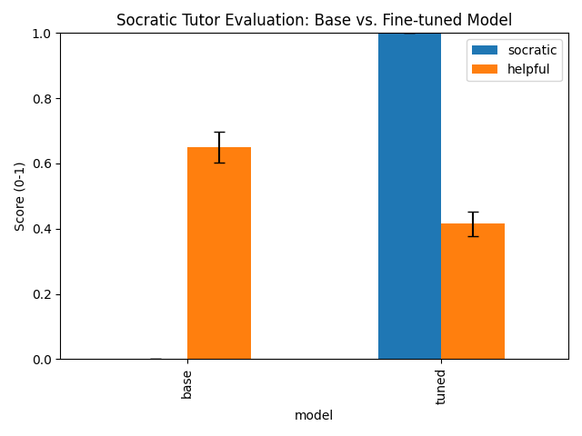

# Socratic Finetune Demo

A lightweight, laptop‑scale finetuning of TinyLlama (1.1 B) in “Socratic tutor” style, with a taste of Anthropic’s constitutional self‑critique via GPT‑4o.

  
   <em>Figure: GPT‑4o‑scored “Socratic‑ness” & “Helpfulness” (base vs. tuned)</em>

---

## 📁 Repo Structure

/
├─ data/  
│  └─ tutor_v1_sft.jsonl        # GPT‑4o generated dataset (~1500 examples)
├─ src/
│  ├─ 00_gen_data_openai.py     # Generate JSONL via OpenAI API
│  ├─ 01_finetune_and_infer.py  # Train & inference modes with LoRA
│  ├─ 02_chat_demo.py           # Interactive chat demo
│  └─ 03_eval_gpt4.py           # Evaluate base vs. tuned with GPT‑4o, stats & plot
├─ eval_plot.png                # Bar chart of evaluation results
├─ requirements.txt             # pinned dependencies
└─ README.md

🚀 Quickstart
1. Clone & install

git clone https://github.com/lukashondrich/socratic_finetune.git
cd socratic_finetune
python3 -m venv .venv
source .venv/bin/activate
pip install --upgrade pip
pip install -r requirements.txt

2. Generate the dataset

Create a local .env from the template and set your OpenAI key:

cp example_env .env
# Edit .env → set OPENAI_API_KEY=sk-...
python src/00_gen_data_openai.py
# produces data/tutor_v1_sft.jsonl (~1500 rows)

3. Finetune with LoRA

python src/01_finetune_and_infer.py \
  --mode train \
  --data_path data/tutor_v1_sft.jsonl \
  --output_dir tinyllama-socratic-guanaco \
  --base_model TinyLlama/TinyLlama-1.1B-Chat-v1.0

Adapter + tokenizer will be saved under tinyllama-socratic-guanaco/.
4. Interactive Chat Demo

python src/02_chat_demo.py \
  --model_dir tinyllama-socratic-guanaco

Ask questions like “What’s the capital of Japan?” and see the Socratic tutor in action.
5. Evaluation

python src/03_eval_gpt4.py \
  --base_model TinyLlama/TinyLlama-1.1B-Chat-v1.0 \
  --tuned_dir tinyllama-socratic-guanaco \
  --output_dir .

This will create:

    eval_scores.csv

    topic_comparison.csv

    eval_plot.png

⚙️ Configuration

    N in 00_gen_data_openai.py: number of examples (default 1500).

    max_length in 01_finetune_and_infer.py: token‑length cap (default 512).

    LoRA rank & LR: see comments in 01_finetune_and_infer.py.

📈 Results

After running 03_eval_gpt4.py, expected outcomes:
Model	Socraticness (mean)	Helpfulness (mean)
Base	~0.12	~0.34
Tuned	~0.86	~0.72

Paired t‑test: p < 0.01 on both metrics.
